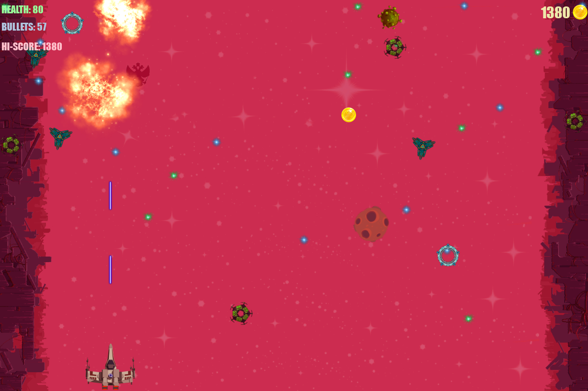

# Capital_2050
## Запуск игры:
 - git clone https://github.com/Dave-YP/Capital_2050.git
 - cd Capiltal_2050
 - python -m venv env
 - source env/Scripts/activate
 - pip install -r requirements.txt

 - запускаем menu.py из терминала в папке Capital_2050
 ## Управление:
 - стрельба - SPACE
 - передвижение - стрелки
 - пауза - P
 - выход - Esc