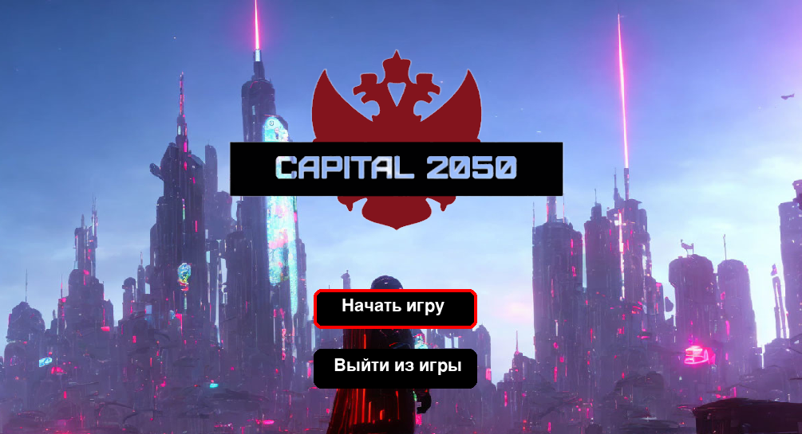
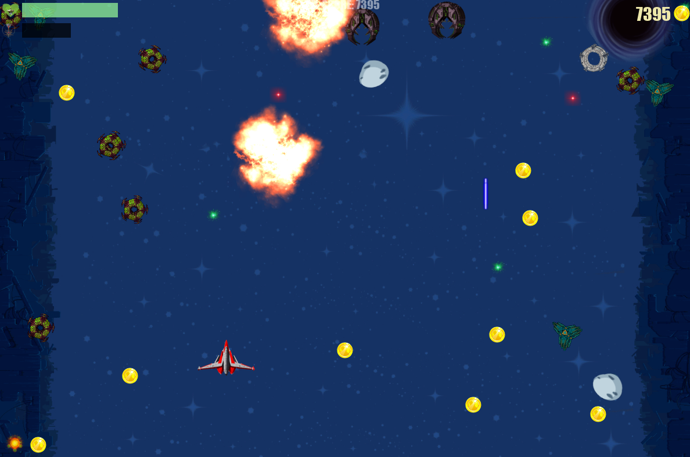

# Cosmic_Heat
Just a communist 2D shooter from a neighboring parallel world. It was written using Python and Pygame. The game is still being updated. To control the player, you can use either the keyboard or a joystick.
## Game launch:
 - git clone https://github.com/Dave-YP/cosmic-heat.git
 - cd cosmic-heat
 - python -m venv env
 - source env/Scripts/activate
 - pip install -r requirements.txt
 ## Controls:
 - shoot - SPACE
 - move - arrows
 - pause - P
 - exit - Esc
